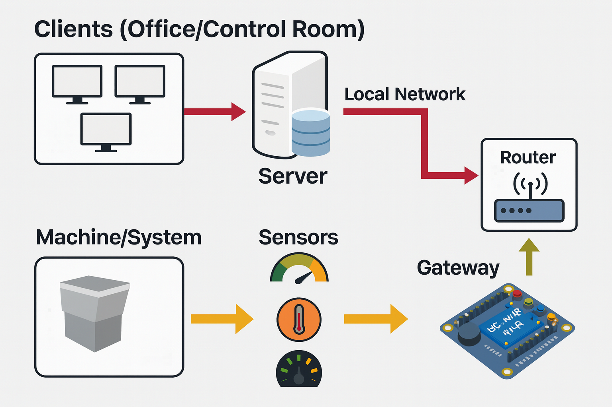
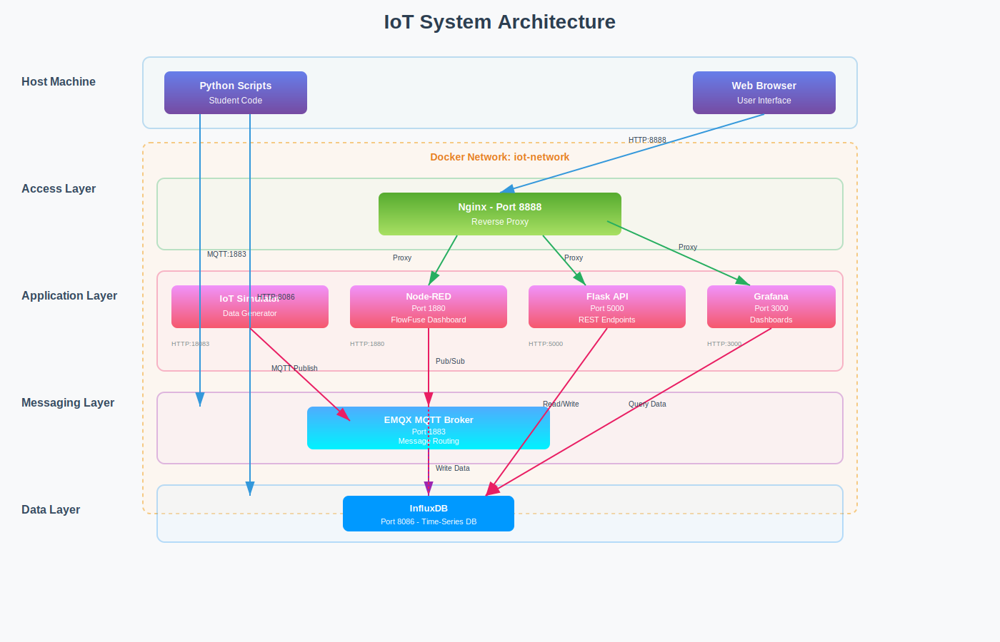

# nd2-learning-journey-2025

## October 4

-   System connection diagram 
    
-   In an industrial context, a **Gateway** refers to a **microcontroller**
    
-   **MCP (Model Context Protocol)** is an open standard protocol developed by Anthropic that allows AI Agents to communicate with the external world (tools, APIs, databases) in a structured and secure manner.  
    It functions like a standardized “USB port” for data connections, enabling LLMs to access domain-specific data and work with external services more easily, without writing custom integrations.
    
-   If we design our own hardware board, we can allow an LLM to learn information from our board and interact with it via prompts.
    
-   IDEs that support MCP include **Cursor** and **Windsurf**
    
-   **Kiro** is an AI Agent IDE (Integrated Development Environment) from Amazon that helps developers work in a more structured way using the concept of **Spec-Driven Development**.  
    Unlike typical AI coding assistants, Kiro focuses on planning, technical design, and creating clear execution plans before writing actual code.  
    This helps ensure a smooth and efficient transition from idea to production-ready software.  
    It is suitable for senior developers or users who already understand relevant prompt keywords.
    

**Key features of Kiro**

1.  **Spec-Driven Development**: Unlike traditional coding approaches (Vibe Coding), Kiro emphasizes planning and creating specifications before implementation to reduce errors.
    
2.  **Multi-day continuous operation**: Acts as an autonomous agent that can learn a developer’s working style and perform complex tasks such as coding, testing, and documentation continuously.
    
3.  **Connectivity**: Supports both IDE and CLI workflows, enabling a smooth transition from prototype to production.
    

----------

## October 11

-   **React Flow (reactflow.dev)** is a library for React developers used to build highly customizable node-based user interfaces.  
    It is suitable for flowcharts, dashboards, data processing tools, chatbots, or systems that require interactive nodes and edges.  
    It emphasizes flexibility in creating custom nodes to display any type of data.
    

**What React Flow can do**

1.  Node-based UI creation: Build interfaces with boxes (nodes) and connections (edges) to represent relationships or workflows.
    
2.  Full customization: Create custom nodes to display forms, charts, or interactive components.
    
3.  Rich interactions: Supports drag & drop, zooming, node connections, context menus, and touch devices.
    
4.  Data flow management: Suitable for data processing applications, chatbot builders, machine learning systems, or even digital musical instruments (synthesizers).
    
5.  Additional features: Collaboration, loop prevention, copy/paste, undo/redo, and state save/restore.
    

**Suitable for**

1.  Developers who want to build visual, data-driven tools
    
2.  Applications requiring graphical interfaces such as data visualization, BPMN tools, mind maps, or diagramming tools
    

----------

-   **Rete.js** is a JavaScript framework for visual programming that focuses on building node-based editors where users can create logic or workflows visually with little or no code.
    

**What Rete.js can do**

1.  Browser-based node editor: Design nodes with input and output ports and connect them directly on a web page.
    
2.  Graph data processing: Includes an engine for processing data and execution logic based on dataflow and control flow.
    
3.  Workflow systems: Suitable for automation systems similar to Zapier or n8n.
    
4.  High customization (modular & tailorable): Plugin-based architecture for features such as context menus, undo/redo, and minimaps.
    
5.  Integration with modern frameworks: Fully compatible with React, Vue, Angular, and Svelte.
    

**Key strengths in 2025**

1.  TypeScript-first development
    
2.  Real-time collaborative editing
    
3.  Rete Studio for converting visual logic to code and code back to visuals
    
4.  High performance, capable of handling large node graphs smoothly
    

----------

-   **Flowise AI (flowiseai.com)** is an open-source platform for building applications powered by Large Language Models (LLMs) such as ChatGPT, Claude, or Google Gemini using a low-code/no-code drag-and-drop approach.
    

**What Flowise can do**  
Flowise is designed to simplify complex frameworks like LangChain into an easy-to-understand visual interface.

1.  Intelligent chatbots that can remember conversation context and answer using your own documents
    
2.  RAG (Retrieval-Augmented Generation) using uploaded PDFs, text files, or connected websites
    
3.  AI Agents that can perform tasks such as web searching, sending emails, or querying SQL databases
    
4.  Multi-agent systems where multiple AI agents collaborate (e.g., one gathers data, another summarizes, another verifies)
    
5.  Integration with vector databases (Pinecone, Weaviate) and automation tools like Zapier or n8n
    

**Key advantages of Flowise**

1.  Easy-to-use visual builder
    
2.  Significant time savings in LLM application development
    
3.  Flexible model support (OpenAI, Anthropic, Hugging Face, local LLMs)
    
4.  Free, open-source, and privacy-friendly (self-hosted)
    

**Suitable for**

1.  Developers who want to rapidly prototype AI applications
    
2.  Businesses building internal AI knowledge bases
    
3.  Non-coders who want to create AI tools without heavy programming
    

----------

-   **OpenAI Workflows**
    

A workflow is a combination of agents, tools, and control-flow logic that covers every step of automated tasks or conversations, with deployable code when ready.

Workflows are part of **AgentKit**, released by OpenAI in October 2025.

**Core features**

1.  Agent Builder – a visual canvas for creating and managing multi-agent workflows
    
2.  Visual workflow design using connected nodes
    
3.  Versioning support
    
4.  Templates for quick setup
    

**What it can be used for**

1.  Customer support agents
    
2.  Research and analysis
    
3.  Content creation
    
4.  Data processing
    
5.  Task automation (booking, scheduling)
    

**Available tools**

1.  Web search
    
2.  File access
    
3.  Python code execution
    
4.  Image generation (DALL·E)
    
5.  Custom APIs
    

----------

-   Learned how to self-host **n8n**, and learned that true self-hosting should also involve running models locally instead of relying on online models.
    
-   **Ollama** is an open-source tool that makes running large language models (LLMs) such as Llama 3 and Mistral on a personal computer extremely easy.  
    It does not rely on cloud services, provides high data privacy, supports offline usage, and has no subscription fees.
    

**Key features of Ollama**

1.  Runs LLMs locally
    
2.  Open-source and free
    
3.  Simple installation and CLI usage
    
4.  Supports multiple popular models
    
5.  Works offline after models are downloaded
    
6.  Strong focus on privacy and security
    
7.  Provides APIs for application integration
    

**Suitable for**

1.  AI developers experimenting with models
    
2.  Businesses with high privacy requirements (finance, healthcare)
    
3.  General users who want local AI experiences
    

----------

-   Learned about **LangChain**, an open-source framework for building applications powered by Large Language Models (LLMs).  
    It provides abstractions and tools for prompt chaining, data access, and application logic without retraining models.
    
-   Learned why **LangChain is important**: LLMs perform well on general knowledge but require integration with internal or domain-specific data for accurate results.
    
-   Learned about **Chain of Thought (CoT)** prompting, a prompt engineering technique that improves multi-step reasoning by guiding the model through logical steps.
    
-   Learned the workflow of AI Agents and challenges related to model selection.
    

----------

## October 18

-   **Zod** is a library for declaring and validating data schemas, primarily designed for TypeScript.  
    It allows developers to define validation rules once and automatically infer TypeScript types, reducing duplication, errors, and improving data safety.
    
-   Learned about **Vite**, a build tool designed to provide a faster and leaner development experience for modern web projects.
    

**Vite overview**

-   Dev Server with extremely fast Hot Module Replacement (HMR)
    
-   Build command using Rollup for optimized production assets
    
-   Opinionated defaults for immediate usability
    
-   Highly extensible through Plugin API and JavaScript API
    
-   Full TypeScript support
    

----------

## October 25

-   Learned about **Penpot**, a design and prototyping tool similar to Figma that can be self-hosted locally.
    
-   Learned how to install and run Penpot on a local environment.
    

----------

## November 1

-   Learned how to use **Figma**, including:
    

1.  Union multiple objects into a single shape
    
2.  Creating gradient color effects
    
3.  Changing pivot or origin points
    
4.  Resizing while preserving origin using Shift
    
5.  Using rulers (Shift + R) for precise alignment when visual centering is inaccurate
    

----------

## November 8

-   A **Frame** in Figma is equivalent to a `
` in HTML
    
-   Learned how to group elements effectively using Auto Layout
    
-   Creating Classes in Figma is comparable to writing code in VS Code
    
-   **Alt + Drag** is used for copying elements
    

----------

## November 15

-   Learned that **NVM (Node Version Manager)** manages Node.js versions similarly to Python’s virtual environment (venv)
    
-   **Netlify** is a powerful cloud platform for modern web development focused on building, deploying, and scaling web applications without managing servers (serverless)
    
-   **Lucidchart** is an online diagramming platform for creating flowcharts, org charts, network diagrams, site maps, and mind maps with real-time collaboration
    
-   **ORM (Object-Relational Mapping)** is a programming technique that maps relational databases to object-oriented code, reducing the need to write raw SQL
    
-   **Prisma** is a database toolkit and next-generation ORM for Node.js and TypeScript
    
-   Learned how scripts in `package.json` work, including the difference between special scripts like `start` and custom scripts that require `npm run`
    
-   Learned basic concepts of **Express.js** and how dependencies are installed
    
-   Learned basic server concepts
    

----------

## November 22

-   **Fastify** is a high-performance web framework for Node.js designed for speed and low overhead, often considered a modern alternative to Express
    
-   Learned a productivity tip: right-clicking a folder and selecting _Open Integrated Terminal_ to avoid directory navigation errors
    
-   Learned more about **Prisma** as a next-generation ORM
    
-   **TSX (TypeScript JSX)** allows writing JSX syntax in TypeScript files, commonly used in React components
    
-   **npx (Node Package Execute)** allows running Node.js packages without global installation
    
-   Learned about server–database communication in a workshop
    
-   Learned how to add and manage scripts for running tasks
    
-   **NestJS** is a structured, scalable backend framework for Node.js widely used in enterprise applications
    

----------

## November 29

-   **D3.js** is a JavaScript library for creating flexible and powerful data visualizations using HTML, SVG, and CSS
    
-   **Next.js** is a React framework optimized for performance, SEO, and full-stack development
    
-   Reviewed **Aliasing**, a phenomenon caused by insufficient sampling that results in distorted signals
    
-   Reviewed **Nyquist Frequency**, the maximum frequency that can be accurately represented in a digital system
    
-   Learned equations for signal generation and adding noise
    

----------

## December 6

-   **Server-Side Rendering (SSR)** is a technique where HTML is generated on the server before being sent to the browser
    
-   Learned to use the VS Code **Live Server** extension
    
-   **TanStack** is a collection of headless, logic-focused libraries for managing complex application state
    

----------

## December 13

-   **Hyper-V** is Microsoft’s virtualization technology that allows running multiple virtual machines on a single physical machine
    
-   Learned and explained system architecture referencing 
    

**Architecture overview**

1.  Host Machine
    
    -   Python scripts for testing and API calls
        
    -   Web browser for UI access
        
2.  Docker Network
    
    -   All services communicate internally
        
3.  Access Layer
    
    -   Nginx reverse proxy (port 8888)
        
4.  Application Layer
    
    -   IoT Simulator
        
    -   Node-RED
        
    -   Flask API
        
5.  Messaging Layer
    
    -   EMQX MQTT Broker
        
6.  Data Layer
    
    -   InfluxDB (time-series database)
        
7.  Visualization Layer
    
    -   Grafana
        

-   Learned how to pull and customize Docker images for reuse
    

----------

## Additional Knowledge

### 1. DevOps Concepts for Automation Systems

DevOps is a set of practices that combines Development (Dev) and Operations (Ops) to enable faster, more reliable, and automated system delivery.

**Core concepts**

1.  Automation First
    
2.  CI/CD
    
3.  Infrastructure as Code (IaC)
    
4.  Monitoring and Logging
    

----------

### 2. Front-End & Back-End

**Front-End**

-   User-facing interfaces
    
-   Dashboards, charts, and real-time data
    
-   Technologies: HTML, CSS, JavaScript, React, Vue, Angular, D3.js, Vega-Lite
    

**Back-End**

-   Data processing and business logic
    
-   Database and device communication
    
-   Technologies: Python (FastAPI, Flask), Node.js (Express, NestJS)
    
-   Databases and messaging systems
    

----------

### 3. Data Processing and AI

**Data Processing Steps**

1.  Data collection
    
2.  Data cleaning
    
3.  Data transformation
    
4.  Data storage
    

**AI / Machine Learning Use Cases**

1.  Predictive maintenance
    
2.  Anomaly detection
    
3.  Forecasting
    

----------

### 4. Deployment & Automation Workflow

**Typical workflow**

1.  Developer writes code
    
2.  Push to Git
    
3.  CI pipeline (build, test)
    
4.  CD pipeline (deploy)
    
5.  Monitoring and alerts
    

**Common tools**

-   Git, GitHub
    
-   GitHub Actions, GitLab CI
    
-   Docker, Kubernetes
    
-   Prometheus, Grafana
